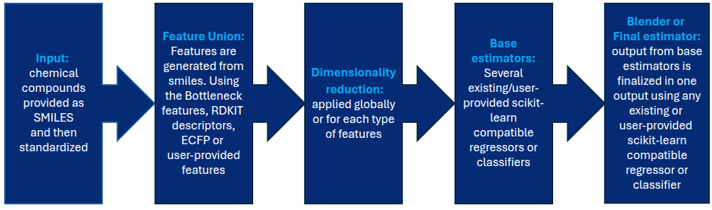
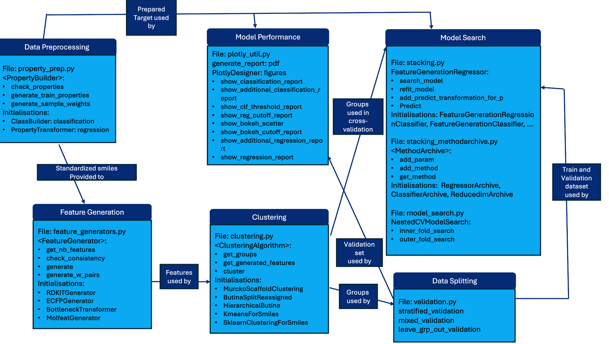
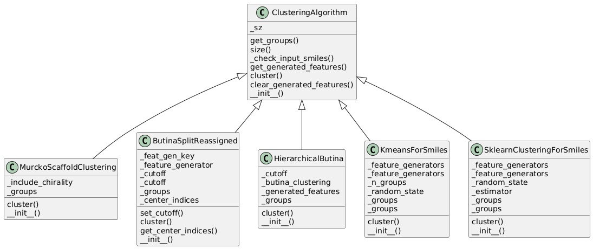
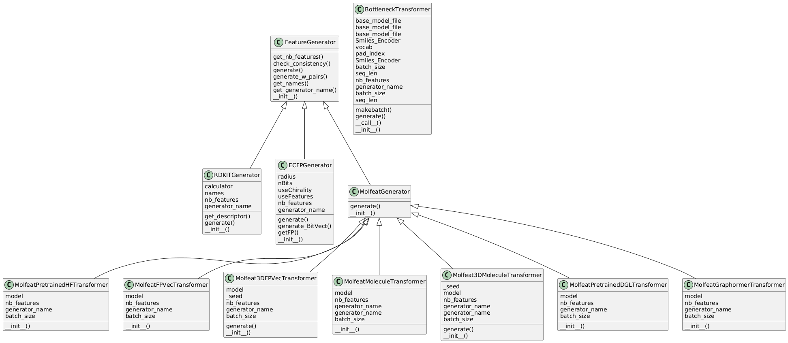
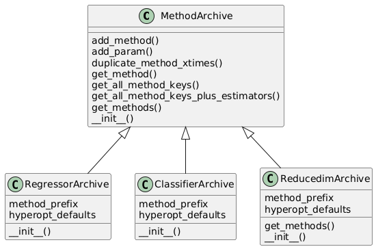
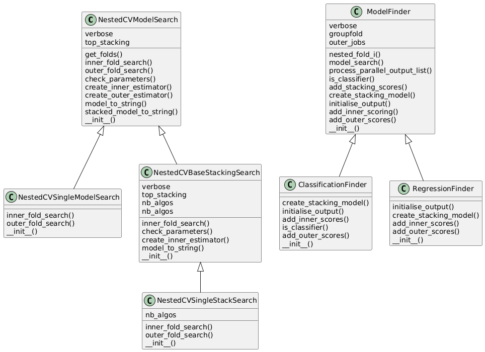
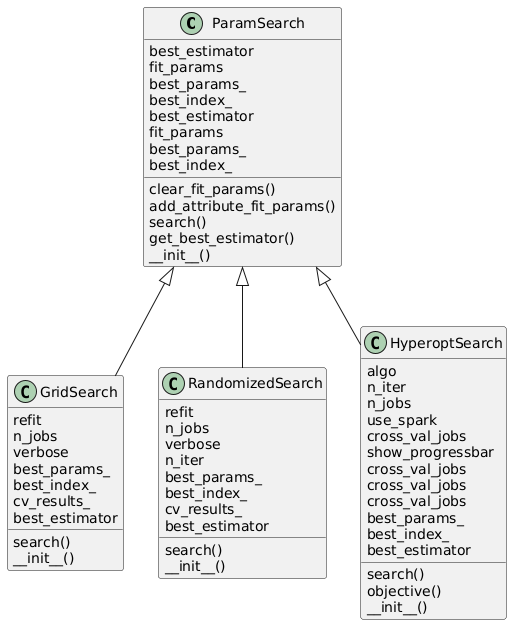
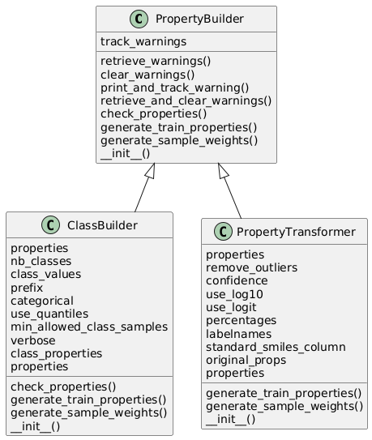
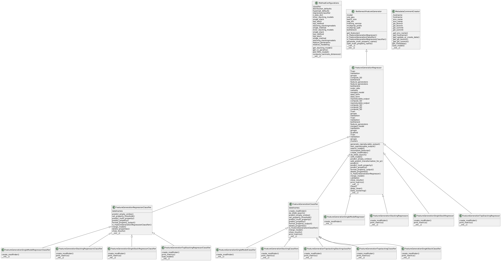

 

# AutoMol

Pipeline for automated machine learning for drug design.

* **Authors**: Mazen Ahmad, Joris Tavernier, Natalia Dyubankova, Marvin Steijaert
* **Contact**: joris.tavernier@openanalytics.eu, Marvin.Steijaert@openanalytics.eu

&copy; All rights reserved, Open Analytics NV, 2021-2025.

## Concept

The idea of the AutoMoL package is to enable Machine Learning for non-experts and their project specific properties. This was made possible by two core concepts: 1) use of highly-informative features and 2) the combination of multiple shallow learners. The overall concept is detailed in the Figure 1 below. The pipeline only requires SMILES as input and a provided property target. These SMILES are first standardized.  Next, features are generated using these standardized smiles. The generated features are optionally given to feature selection or dimensionality reduction methods before training several base estimators. The predictions of these base estimators are then provided as input to train a final estimator or blender. The predictions of this final estimator is the final output. The AutoMoL pipeline can be used for regression or classification tasks.

 Figure 1. The concept of AutoMoL. Starting from the smiles, 
             features are generated and these features are used to
             train a combination of several shallow learners.

 Figure 2. Scheme of the pipeline using code classes and functions.

 Figure 3. UML of the file clustering.py.

 Figure 4. UML of the file feature_generators.py.

 Figure 5. UML of the file stacking_methodarchive.py.

 Figure 6. UML of the file model_search.py.

 Figure 7. UML of the file param_search.py.

 Figure 8. UML of the file property_prep.py.

 Figure 8. UML of the file stacking.py.