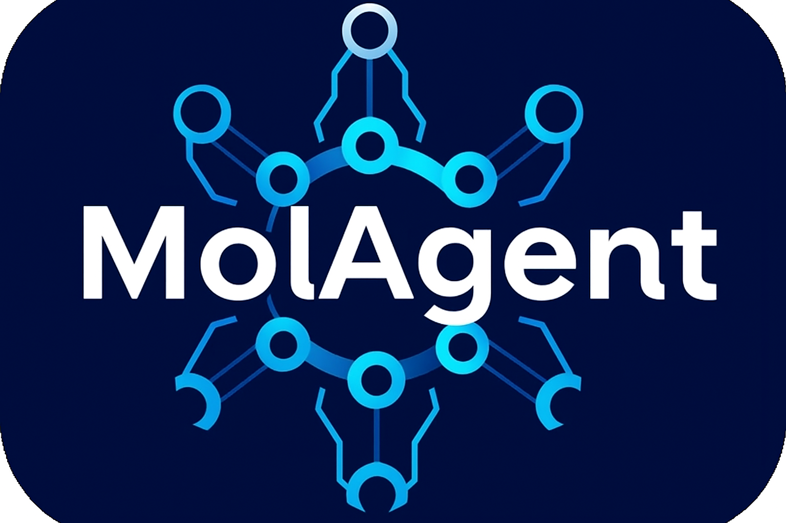
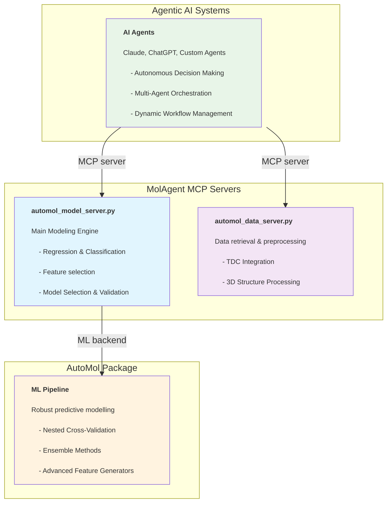

 

# MolAgent

<div align="center">

[](https://github.com/openanalytics/MolAgent)
[](https://python.org)
[](https://docs.anthropic.com/en/docs/agents-and-tools/mcp)
[](https://github.com/openanalytics/AutoMol)
[](LICENSE)
[](https://github.com/openanalytics/MolAgent)

# **MolAgent is an evolving Multi-Agent System to support all aspects of early-stage drug discovery** 

[Installation](#install-package) • [MCP server](#%EF%B8%8F-mcp-server-architecture) • [Setup](#starting-mcp-servers-locally) • [Usage](#examples) • [Support](#contacts)

</div>

## **The current version of MolAgent focusing on introducing the agnetic compoments which are needed for delivering expert-level predictive modeling capabilities:**
- **🧠 Autonomous Model Construction**: AI agents that can train predictive models with human expert-level quality
- **⚡ On-the-fly Training**
- **🔧 MCP-Based Architecture**: the componenets are Built as **Model Context Protocol (MCP) servers** to be system-agnostic and ensuring compatibility with various agentic frameworks.

### 📄Citation

**MolAgent: Biomolecular Property Estimation in the Agentic Era**

Jose Carlos Gómez-Tamayo*, Joris Tavernier**, Roy Aerts***, Natalia Dyubankova*, Dries Van Rompaey*, Sairam Menon*, Marvin Steijaert**, Jörg Wegner*, Hugo Ceulemans*, Gary Tresadern*, Hans De Winter***, Mazen Ahmad* 
> \*Johnson & Johnson \
>  ** Open Analytics NV \
>  ***Laboratory of Medicinal Chemistry, Department of Pharmaceutical Sciences, University of Antwerp

**Funding**: This work was partly funded by the Flanders innovation & entrepreneurship (VLAIO) project HBC.2021.112. 

```bibtex
@article{molagent2025,
  title={MolAgent: Biomolecular Property Estimation in the Agentic Era},
  author={Gómez-Tamayo, Jose Carlos and Tavernier, Joris and Aerts, Roy and 
          Dyubankova, Natalia and Van Rompaey, Dries and Menon, Sairam and 
          Steijaert, Marvin and Wegner, Jörg and Ceulemans, Hugo and 
          Tresadern, Gary and De Winter, Hans and Ahmad, Mazen},
  journal={Preprint},
  year={2025}
}
```

Our **roadmap** includes expanding from the current componenents into a full multi agentic ecosystem of specialized agents including deep research, predective modeling, molecular generation and biopharmaceutical/pharmacokinetic characterization in the drug design process

### abstract

The advent of agentic AI systems is leading to significant transformations acrossscientific and technological domains. Computer-aided drug design (CADD)—a multifaceted process encompassing complex, interdependent tasks—stands to benefitprofoundly from these advancements. However, a challenge is empowering agentic systems to autonomously construct models for properties estimation that match the quality and reliability of those developed by human experts. As this is not currently straight forward, this capability represents a major bottleneck for fully realizing the potential of autonomous pipelines in drug discovery. We present here MolAgent, a system-agnostic agentic AI framework designed for high-fidelity modeling of molecular properties in early-stage drug discovery. MolAgent autonomously implements expert-level pipelines for both classification and regression, empowering agentic systems to efficiently construct and deploy models. With integrated automated feature engineering, robust model selection, advanced ensemble methodologies, and comprehensive validation frameworks, MolAgent ensures optimal accuracy and model robustness. The platform seamlessly accepts 2D and 3D structural data for ligands and receptors and harmonizes traditional molecular descriptors with advanced deep learning features extracted from pretrained 2D and 3D encoders. Ultimately the platform’s fully automated, end-to-end workflow is designed for seamless agentic execution. Adherence to the Model Context Protocol (MCP) guarantees interoperability with diverse agenticAI infrastructures, ensuring flexible integration into complex, future discovery pipelines.

### Architecture Overview

MolAgent leverages backend ML pipelines from the **[AutoMol](https://github.com/openanalytics/AutoMol)** package, providing a seamless bridge between expert-level molecular modeling and agentic AI systems:



---

## Core Capabilities

MolAgent enables the following expert-level capabilities through agentic AI:

### 🧠 **Autonomous Model Construction**
- **Expert-Level Pipelines**: Implements sophisticated ML workflows comparable to human experts
- **Dynamic Feature Selection**: Automatically selects optimal molecular representations
- **Intelligent Hyperparameter Optimization**: Nested cross-validation with Bayesian optimization
- **Ensemble Methods**: Advanced stacking and blending strategies

### 🔬 **Comprehensive Molecular Modeling**
- **2D & 3D Representations**: Traditional descriptors to advanced deep learning embeddings
- **Protein-Ligand Interactions**: Structure-based features for binding affinity prediction
- **Chemical-Aware Validation**: Scaffold-based splitting to avoid data leakage
- **Multi-Modal Integration**: Harmonizes diverse molecular data types

### 🤖 **Agentic AI Integration**
- **MCP-Compliant**: integration with Claude, ChatGPT, and custom agents
- **Zero-Configuration**: out-of-the-box with sensible defaults
- **Multi-Agent Orchestration**: complex workflows with data and modeling agents
- **Real-Time Adaptation**: workflow management based on data characteristics

---

## 🛠️ MCP Server Architecture

###  **Primary Server: `automol_model_server.py`**
The main modeling engine providing machine learning capabilities:

| Tool | Category | Description | Complexity |
|------|----------|-------------|------------|
| `automol_regression_model` | Modeling | Train regression models for continuous molecular properties | High |
| `automol_classification_model` | Modeling | Train classification models for categorical molecular properties | High |
| `list_tools` | Utility | Comprehensive tool and capability discovery | Low |
| `get_server_status` | Utility | Server health monitoring and diagnostics | Low |


###  **Auxiliary Server: `automol_data_server.py`**
We provided additionally a data server for data handling and preparation using the [Therapeutic Data commons](https://tdcommons.ai/) (TDC) and processing 3D structure data:

| Tool | Category | Description | Use Case |
|------|----------|-------------|----------|
| `retrieve_tdc_data` | Data Access | Download datasets from Therapeutic Data Commons | Public datasets |
| `retrieve_tdc_groups` | Data Discovery | List available TDC problem groups | Dataset exploration |
| `retrieve_tdc_group_datasets` | Data Discovery | List datasets within specific TDC group | Targeted search |
| `retrieve_3d_data` | 3D Processing | Extract properties from SDF files with 3D structures | Structure-based modeling |

You can use the 3D features if you provide 3d information in the form of an sdf file and pdb files. Al the different pdbs should be placed in the same folder. This folder should be provided. The sdf file contains all the structures of the compounds. There should be a property pdb referencing the name of the pdb file to be used. Next to the pdb name, the code also requires a property with the target value of the compound. For example, after unzipping <i>Data/manuscript_data.zip</i>,  <i>Data/manuscript_data/ABL/selected_dockings.sdf</i> contains the ligands and the pdbs are located in <i>Data/manuscript_data/ABL/pdbs</i>. 

---

### 📊 Benchmark Performance

MolAgent achieves **competitive performance** with expert-crafted models on TDC benchmarks using only "cheap" computational budget for the ADME group:

Dataset | MolAgent on the fly| Best by human | Ranking | Metric 
|---------|----------|------------|---------|---------|
Caco2_Wang | 0.303+-0.002 | 0.276+-0.005 | 6th | MAE | 
Hia_hou | 0.87+-0.006 | 0.989+-0.001 | 14th | AUROC | 
pgp_broccatelli | 0.849+-0.005 | 0.938+-0.006 | 15th | AUROC  |
Bioavailability_ma | 0.619+-0.028 | 0.748+-0.033 | 10th | AUROC | 
Lipophilicity_astrazeneca | 0.309+-0.001 | 0.467+-0.006 | 🥇 1st | MAE | 
Solubility_aqsoldb | 0.889+-0.001 | 0.761+-0.024 | 8th | MAE  |
bbb_martins | 0.757+-0.004 | 0.916+-0.001 | 21st | AUROC  |
Ppbr_az  |7.86+-0.3 | 7.526+-0.106 | 4th | MAE  |
Vdss_lombardo  | 0.29+-0.175 | 0.713+-0.007 | 13th | Spearman | 
Cyp2d6_veith | 0.386+-0.007 | 0.790+-0.001 | 14th | AUPRC  |
Cyp3a4_veith | 0.704+-0.001 | 0.916+-0.000 | 14th | AUPRC  |
Cyp2c9_veith | 0.605+-0.004 | 0.859+-0.001 | 15th | AUPRC  |
Cyp2d6_substrate_carbonmangels | 0.526+-0.027 | 0.736+-0.025 | 13th | AUPRC | 
Cyp3a4_substrate_carbonmangels | 0.613+-0.019 | 0.662+-0.031 | 10th | AUROC  |
Cyp2c9_substrate_carbonmangels | 0.384+-0.017 | 0.441+-0.033 | 8th | AUPRC  |
Half_life_obach | 0.332+-0.047 | 0.562+-0.008 | 7th | Spearman  |
Clearance_microsome_az | 0.651+-0.04 | 0.630+-0.010 | 🥇 1st | Spearman  |
Clearance_hepatocyte_az | 0.445+-0.028 | 0.498+-0.009 | 🥉 3rd | Spearman  |
herg | 0.624+-0.02 | 0.880+-0.002 | 17th | AUROC  |
ames | 0.793+-0.005 | 0.871+-0.002 | 13th | AUROC  |
dili | 0.778+-0.025 | 0.925+-0.005 | 16th | AUROC | 
Ld50_zhu | 0.606+-0.0 | 0.552+-0.009 | 🥉 3rd | MAE |

<p style="font-size: 10px";> Table 1. Performance of MolAgent under “cheap” computational budget across ADMET tasks from the Therapeutics
Data Commons (TDC) benchmark. Results are reported as mean ± standard deviation over 5 independent runs
(different seeds). The “MolAgent” column denotes MolAgent’s performance, whereas “Best” corresponds to the best
result achieved by existing human-fine-tuned models. “Ranking” indicates MolAgent’s position relative to all
evaluated baselines in TDC leaderboard. The “Metric” column specifies the evaluation criterion: mean absolute error
(MAE; lower values are better) for regression tasks, area under the receiver operating characteristic curve (AUROC;
higher values are better), area under the precision-recall curve (AUPRC; higher values are better), and Spearman
correlation coefficient (higher values are better). MolAgent attains competitive accuracy compared to human-fine-
tuned models while operating with substantially lower computational overhead.</p>


> 📈 **Results obtained with "cheap" computational budget** - demonstrating efficiency with competitive accuracy!


---

## 🚀 Quick Start

### Install package
To use MolAgent, include the git submodule of AutoMol by cloning the repository with submodules
```{bash}
git clone --recurse-submodules https://github.com/openanalytics/MolAgent
```
For automated pdf generation [wkhtmltopdf](https://wkhtmltopdf.org/) is used. On linux install with
```{bash}
sudo apt-get install wkhtmltopdf
```
We recommend using an uv environment for this package. The MCP server uses AutoMol which is cloned from the repository. 
```{bash}
pip install uv
uv venv molagent_env --python 3.12
source molagent_env/bin/activate
uv pip install AutoMol/automol_resources/
uv pip install AutoMol/automol/
uv pip install molfeat
uv pip install streamlit
uv pip install PyTDC
uv pip install torch_geometric prolif lightning
uv pip install rdkit==2024.3.5
```
Alternatively,you can use the requirements file:
```{bash}
pip install uv
uv venv molagent_env --python 3.12
source molagent_env/bin/activate
uv pip install -r requirements.txt
```
Additionally, you can use the provided docker image, still requires the installation of AutoMol. 

---
### Starting MCP servers locally
Using the molagent_env environment, you can start the servers locally, by running the following commands in the terminal. We advise to run the servers from the notebook directory, since the mcp servers will save files only starting from the directory they are run from. 

Start data training server locally on port 8000: 
```{bash}
source molagent_env/bin/activate
cd MCP/
uv run mcp_server/automol_data_server.py
```
Start model training server locally  on port 8001:
```{bash}
source molagent_env/bin/activate
cd MCP/
uv run mcp_server/automol_model_server.py
```
In the terminal of the model server, you can follow the progress of the model training. 

---
### Claude Desktop integration

```{bash}
claude mcp add --transport sse  automoldata https://localhost:8000/sse
claude mcp add --transport sse automolmodelling https://localhost:8001/sse
```
---
### Tool Inspector

You can start the MCP tool inspector by running:
```
npx @modelcontextprotocol/inspector
```
Make sure to copy the session token and set it as Proxy Session Token (under configuration) in the inspector GUI. Then set transport type as SSE with either 
```
http://localhost:8001/sse
```
or
```
http://localhost:8000/sse
``` 
as URL.

---
# Examples


## Integration with SmolAgents
The notebook [gradio](MCP/Lipophilicity_AstraZeneca.ipynb) shows the integration using SmolAgents and the gradio interface. A list of examples for the multi-agentic framework is provided in the notebook: [examples](MCP/MolAgent_multiagent.ipynb)

The notebooks use some additional libraries:
```{bash}
uv pip install python-dotenv
uv pip install transformers smolagents[all] fastmcp
uv pip install jupyter jupyterlab
```
Create a file .env with the following content:

```{bash}
ANTHROPIC_API_KEY = xxxx
HF_TOKEN=xxxx
HF_HOME=hf_home/
TOKENIZERS_PARALLELISM=false
```
You can add any key you want in the .env file.

You can run jupyter-lab within the uv environment using the following command:
```{bash}
uv run --with jupyter jupyter lab
```

## Using FastMCP Client
You can call the tools directly using the client functionality of FastMCP. We'll show some basic examples of how to call the tools available in the MCP servers. 

#### Check health of the modelling server

```python
import asyncio
from fastmcp import Client

# HTTP server
client = Client("http://127.0.0.1:8001/sse")

async def main():
    async with client:
        # Basic server interaction
        await client.ping()
        
        # List available operations
        tools = await client.list_tools()
        print(tools)
        resources = await client.list_resources()
        print(resources)
        prompts = await client.list_prompts()
        print(prompts)
        
        # Execute operations
        server_health = await client.call_tool("get_server_status")
        print(server_health)

asyncio.run(main())
```

#### Regression example using CHEMBL data samples

After unzipping the archived file in the folder Data, you can train a regression model using the following code.

```python
import asyncio
from fastmcp import Client

# HTTP server
client = Client("http://127.0.0.1:8001/sse",timeout=1e10)

async def main():
    async with client:
        # Basic server interaction
        await client.ping()
        
        model_test = await client.call_tool("automol_regression_model",
                    arguments={
                        'data_file': '../Data/manuscript_data/ChEMBL_SMILES.csv',
                        'smiles_column': 'smiles',
                        'property': 'prop1',
                        'feature_keys': ['Bottleneck', 'rdkit'],
                        'computational_load': 'cheap',
                        'json_dict_file_nm': 'out.json',
                        })

asyncio.run(main())
```

#### Lipophilicity example from the Therapeutics Data Commons

This example first download the model using the data MCP server and next use the model MCP server to fit a predictive model. 

```python
import asyncio
from fastmcp import Client

# HTTP server
data_client = Client("http://127.0.0.1:8000/sse",timeout=1e10)
model_client = Client("http://127.0.0.1:8001/sse",timeout=1e10)

async def main():
    async with data_client:
        # Basic server interaction
        await data_client.ping()

        data_return_statement = await data_client.call_tool("retrieve_tdc_data",
                    arguments={
                        'save_dir': 'tdc_data',
                        'dataset_name': 'Lipophilicity_AstraZeneca',
                        'data_dir': '.',
                        'file_nm': 'lipo.csv',
                        'group': 'ADME'
                        })
        print(data_return_statement)
        

    async with model_client:
        # Basic server interaction
        await model_client.ping()

        model_return_statement = await model_client.call_tool("automol_regression_model",
                    arguments={
                        'data_file': 'lipo.csv',
                        'smiles_column': 'Drug',
                        'property': 'Y',
                        'feature_keys': ['Bottleneck'],
                        'computational_load': 'cheap',
                        'json_dict_file_nm': 'lipo.json',
                        })
        print(model_return_statement)

asyncio.run(main())
```

### License

[](LICENSE) See the [LICENSE](LICENSE) file for details.

---
## References
MolAgent relies on the following open-source projects and tools:
1. [scikit-learn](https://scikit-learn.org/stable/): Pedregosa, F., Varoquaux, G., Gramfort, A., Michel, V., Thirion, B., Grisel, O., ... & Duchesnay, É. (2011). Scikit-learn: Machine learning in Python. the Journal of machine Learning research, 12, 2825-2830.
2. [Therapeutic Data commons](https://tdcommons.ai/): Huang, K., Fu, T., Gao, W. et al. Artificial intelligence foundation for therapeutic science. Nat Chem Biol 18, 1033–1036 (2022). https://doi.org/10.1038/s41589-022-01131-2
3. [molfeat](https://molfeat.datamol.io/): Emmanuel Noutahi, Cas Wognum, Hadrien Mary, Honoré Hounwanou, Kyle M. Kovary, Desmond Gilmour, thibaultvarin-r, Jackson Burns, Julien St-Laurent, t, DomInvivo, Saurav Maheshkar, & rbyrne-momatx. (2023). datamol-io/molfeat: 0.9.4 (0.9.4). Zenodo. https://doi.org/10.5281/zenodo.8373019
4. [Pytorch](https://pytorch.org/)
5. [FastMCP](https://github.com/jlowin/fastmcp)
6. [Prolif](https://prolif.readthedocs.io/en/stable/index.html): Bouysset, C., Fiorucci, S. ProLIF: a library to encode molecular interactions as fingerprints.
J Cheminform 13, 72 (2021). https://doi.org/10.1186/s13321-021-00548-6

## Contacts

* **Developers**: Joris Tavernier and Marvin Steijaert and Gómez-Tamayo, Jose Carlos and Mazen Ahmad
* **maintainers**: joris.tavernier@openanalytics.eu, Marvin.Steijaert@openanalytics.eu
