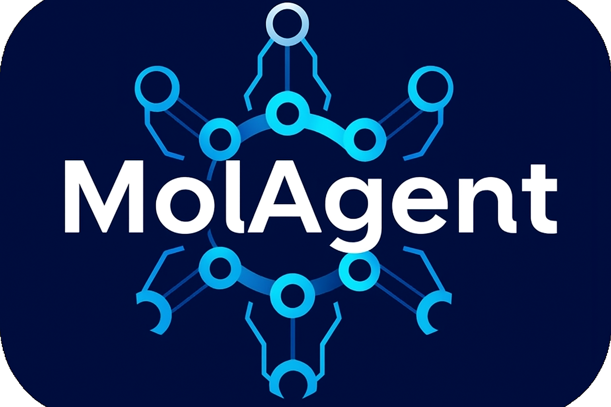
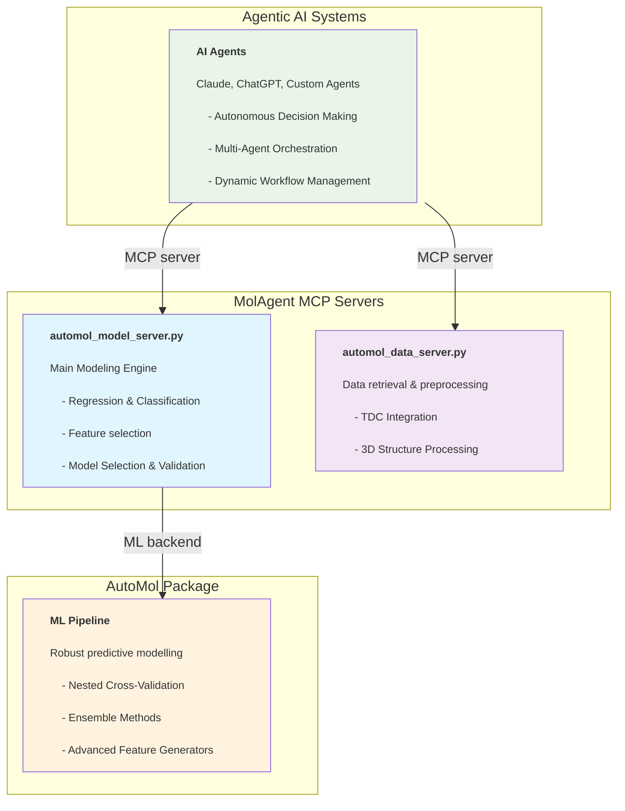

 

# MolAgent

<div align="center">

[](https://python.org)
[](https://docs.anthropic.com/en/docs/agents-and-tools/mcp)
[](https://github.com/openanalytics/AutoMol)
[](LICENSE)
[](https://github.com/openanalytics/MolAgent)

**MolAgent, a system-agnostic agentic AI framework designed for high-fidelity modeling of molecular properties in early-stage drug discovery**


[Installation](#install-package) • [MCP server](#%EF%B8%8F-mcp-server-architecture) • [Setup](#starting-mcp-servers-locally) • [Usage](#examples) • [Support](#contacts)

</div>

## 🌟 Overview

**MolAgent** is a cutting-edge, system-agnostic agentic AI framework designed for high-fidelity predictive modeling of molecular properties in early-stage drug discovery. Built as **Model Context Protocol (MCP) servers**, MolAgent empowers autonomous AI agents to construct expert-level machine learning models with minimal human intervention.

### abstract

The advent of agentic AI systems is leading to significant transformations acrossscientific and technological domains. Computer-aided drug design (CADD)—a multifaceted process encompassing complex, interdependent tasks—stands to benefitprofoundly from these advancements. However, a challenge is empowering agentic systems to autonomously construct models for properties estimation that match the quality and reliability of those developed by human experts. As this is not currently straight forward, this capability represents a major bottleneck for fully realizing the potential of autonomous pipelines in drug discovery. We present here MolAgent, a system-agnostic agentic AI framework designed for high-fidelity modeling of molecular properties in early-stage drug discovery. MolAgent autonomously implements expert-level pipelines for both classification and regression, empowering agentic systems to efficiently construct and deploy models. With integrated automated feature engineering, robust model selection, advanced ensemble methodologies, and comprehensive validation frameworks, MolAgent ensures optimal accuracy and model robustness. The platform seamlessly accepts 2D and 3D structural data for ligands and receptors and harmonizes traditional molecular descriptors with advanced deep learning features extracted from pretrained 2D and 3D encoders. Ultimately the platform’s fully automated, end-to-end workflow is designed for seamless agentic execution. Adherence to the Model Context Protocol (MCP) guarantees interoperability with diverse agenticAI infrastructures, ensuring flexible integration into complex, future discovery pipelines.

### Architecture Overview

MolAgent leverages backend ML pipelines from the **[AutoMol](https://github.com/openanalytics/AutoMol)** package, providing a seamless bridge between expert-level molecular modeling and agentic AI systems:


```mermaid
graph TB
    subgraph "MolAgent MCP Servers"
        MS["`<p style="font-size: 12px; width:250px;text-align: left;"><b>automol_model_server.py</b><br>
Main Modeling Engine<br>
    - Regression & Classification<br>
    - Feature selection<br>
    - Model Selection & Validation</p>`"]
        DS["`<p style="font-size: 12px; width:250px;text-align: left;"><b>automol_data_server.py</b><br>
Data retrieval & preprocessing<br>
    - TDC Integration<br>
    - 3D Structure Processing</p>`"]
    end
    
    subgraph "AutoMol Package"
        AP["` <p style="font-size: 12px; width:250px;text-align: left;"><b>ML Pipeline</b><br>
Robust predictive modelling<br>
    - Nested Cross-Validation<br>
    - Ensemble Methods<br>
    - Advanced Feature Generators</p>`"]
    end
    
    subgraph "Agentic AI Systems"
        AG["` <p style="font-size: 12px; width:250px;text-align: left;"><b>AI Agents</b><br>
Claude, ChatGPT, Custom Agents<br>
    - Autonomous Decision Making<br>
    - Multi-Agent Orchestration<br>
    - Dynamic Workflow Management </p>`"]
    end
    
    AG -->|MCP server| MS
    AG -->|MCP server| DS
    MS -->|ML backend| AP
    
    style MS fill:#e1f5fe, width:275px
    style DS fill:#f3e5f5, width:275px
    style AP fill:#fff3e0, width:275px
    style AG fill:#e8f5e8, width:275px
```

---

## Core Capabilities

MolAgent enables the following expert-level capabilities through agentic AI:

### 🧠 **Autonomous Model Construction**
- **Expert-Level Pipelines**: Implements sophisticated ML workflows comparable to human experts
- **Dynamic Feature Selection**: Automatically selects optimal molecular representations
- **Intelligent Hyperparameter Optimization**: Nested cross-validation with Bayesian optimization
- **Ensemble Methods**: Advanced stacking and blending strategies

### 🔬 **Comprehensive Molecular Modeling**
- **2D & 3D Representations**: Traditional descriptors to advanced deep learning embeddings
- **Protein-Ligand Interactions**: Structure-based features for binding affinity prediction
- **Chemical-Aware Validation**: Scaffold-based splitting to avoid data leakage
- **Multi-Modal Integration**: Harmonizes diverse molecular data types

### 🤖 **Agentic AI Integration**
- **MCP-Compliant**: integration with Claude, ChatGPT, and custom agents
- **Zero-Configuration**: out-of-the-box with sensible defaults
- **Multi-Agent Orchestration**: complex workflows with data and modeling agents
- **Real-Time Adaptation**: workflow management based on data characteristics

---

## 🛠️ MCP Server Architecture

###  **Primary Server: `automol_model_server.py`**
The main modeling engine providing machine learning capabilities:

| Tool | Category | Description | Complexity |
|------|----------|-------------|------------|
| `automol_regression_model` | Modeling | Train regression models for continuous molecular properties | High |
| `automol_classification_model` | Modeling | Train classification models for categorical molecular properties | High |
| `list_tools` | Utility | Comprehensive tool and capability discovery | Low |
| `get_server_status` | Utility | Server health monitoring and diagnostics | Low |


###  **Auxiliary Server: `automol_data_server.py`**
We provided additionally a data server for data handling and preparation using the [Therapeutic Data commons](https://tdcommons.ai/) and processing 3D structure data:

| Tool | Category | Description | Use Case |
|------|----------|-------------|----------|
| `retrieve_tdc_data` | Data Access | Download datasets from Therapeutic Data Commons | Public datasets |
| `retrieve_tdc_groups` | Data Discovery | List available TDC problem groups | Dataset exploration |
| `retrieve_tdc_group_datasets` | Data Discovery | List datasets within specific TDC group | Targeted search |
| `retrieve_3d_data` | 3D Processing | Extract properties from SDF files with 3D structures | Structure-based modeling |

You can use the 3D features if you provide 3d information in the form of an sdf file and pdb files. Al the different pdbs should be placed in the same folder. This folder should be provided. The sdf file contains all the structures of the compounds. There should be a property pdb referencing the name of the pdb file to be used. Next to the pdb name, the code also requires a property with the target value of the compound. For example, after unzipping <i>Data/manuscript_data.zip</i>,  <i>Data/manuscript_data/ABL/selected_dockings.sdf</i> contains the ligands and the pdbs are located in <i>Data/manuscript_data/ABL/pdbs</i>. 

---
## 🚀 Quick Start

### Install package
To use MolAgent, include the git submodule of AutoMol by cloning the repository with submodules
```{bash}
git clone --recurse-submodules https://github.com/openanalytics/MolAgent
```
For automated pdf generation [wkhtmltopdf](https://wkhtmltopdf.org/) is used. On linux install with
```{bash}
sudo apt-get install wkhtmltopdf
```
We recommend using an uv environment for this package. The MCP server uses AutoMol which is cloned from the repository. 
```{bash}
pip install uv
uv venv molagent_env --python 3.12
source molagent_env/bin/activate
uv pip install AutoMol/automol_resources/
uv pip install AutoMol/automol/
uv pip install molfeat
uv pip install streamlit
uv pip install PyTDC
uv pip install torch_geometric prolif lightning
uv pip install rdkit==2024.3.5
uv pip install transformers smolagents[all] fastmcp
uv pip install jupyter jupyterlab
uv run --with jupyter jupyter lab
```
Alternatively,you can use the requirements file:
```{bash}
pip install uv
uv venv molagent_env --python 3.12
source molagent_env/bin/activate
uv pip install -r requirements.txt
```
Additionally, you can use the provided docker image, still requires the installation of AutoMol. 

---
### Starting MCP servers locally
Using the molagent_env environment, you can start the servers locally, by running the following commands in the terminal. We advise to run the servers from the notebook directory, since the mcp servers will save files only starting from the directory they are run from. 

Start data training server locally on port 8000: 
```{bash}
source molagent_env/bin/activate
cd MCP/
uv run mcp_server/automol_data_server.py
```
Start model training server locally  on port 8001:
```{bash}
source molagent_env/bin/activate
cd MCP/
uv run mcp_server/automol_model_server.py
```
In the terminal of the model server, you can follow the progress of the model training. 

---
### Agent integration
After starting the server you can integrate them. For smolagents, see the notebooks in the MCP folder.
For Claude:
```{bash}
claude mcp add --transport sse  automoldata https://localhost:8000/sse
claude mcp add --transport sse automolmodelling https://localhost:8001/sse
```
---
### Tool Inspector

You can start the MCP tool inspector by running:
```
npx @modelcontextprotocol/inspector
```
Make sure to copy the session token and set it as Proxy Session Token (under configuration) in the inspector GUI. Then set transport type as SSE with either 
```
http://localhost:8001/sse
```
or
```
http://localhost:8000/sse
``` 
as URL.

---
## 📄 License & Citation

### Citation
If you use MolAgent in your research, please cite our paper:

```bibtex
@article{molagent2025,
  title={MolAgent: Biomolecular Property Estimation in the Agentic Era},
  author={Gómez-Tamayo, Jose Carlos and Tavernier, Joris and Aerts, Roy and 
          Dyubankova, Natalia and Van Rompaey, Dries and Menon, Sairam and 
          Steijaert, Marvin and Wegner, Jörg and Ceulemans, Hugo and 
          Tresadern, Gary and De Winter, Hans and Ahmad, Mazen},
  journal={Preprint},
  year={2025}
}
```
### License

See the [LICENSE](LICENSE) file for details.[](LICENSE)

---
## References
MolAgent relies on the following open-source projects and tools:
1. [scikit-learn](https://scikit-learn.org/stable/): Pedregosa, F., Varoquaux, G., Gramfort, A., Michel, V., Thirion, B., Grisel, O., ... & Duchesnay, É. (2011). Scikit-learn: Machine learning in Python. the Journal of machine Learning research, 12, 2825-2830.
2. [Therapeutic Data commons](https://tdcommons.ai/): Huang, K., Fu, T., Gao, W. et al. Artificial intelligence foundation for therapeutic science. Nat Chem Biol 18, 1033–1036 (2022). https://doi.org/10.1038/s41589-022-01131-2
3. [molfeat](https://molfeat.datamol.io/): Emmanuel Noutahi, Cas Wognum, Hadrien Mary, Honoré Hounwanou, Kyle M. Kovary, Desmond Gilmour, thibaultvarin-r, Jackson Burns, Julien St-Laurent, t, DomInvivo, Saurav Maheshkar, & rbyrne-momatx. (2023). datamol-io/molfeat: 0.9.4 (0.9.4). Zenodo. https://doi.org/10.5281/zenodo.8373019
4. [Pytorch](https://pytorch.org/)
5. [FastMCP](https://github.com/jlowin/fastmcp)

## Contacts

* **Authors**: Gómez-Tamayo, Jose Carlos and Tavernier, Joris and Aerts, Roy and 
          Dyubankova, Natalia and Van Rompaey, Dries and Menon, Sairam and 
          Steijaert, Marvin and Wegner, Jörg and Ceulemans, Hugo and 
          Tresadern, Gary and De Winter, Hans and Ahmad, Mazen
* **Developers**: Joris Tavernier and Marvin Steijaert and Gómez-Tamayo, Jose Carlos and Mazen Ahmad
* **Contact**: joris.tavernier@openanalytics.eu, Marvin.Steijaert@openanalytics.eu

