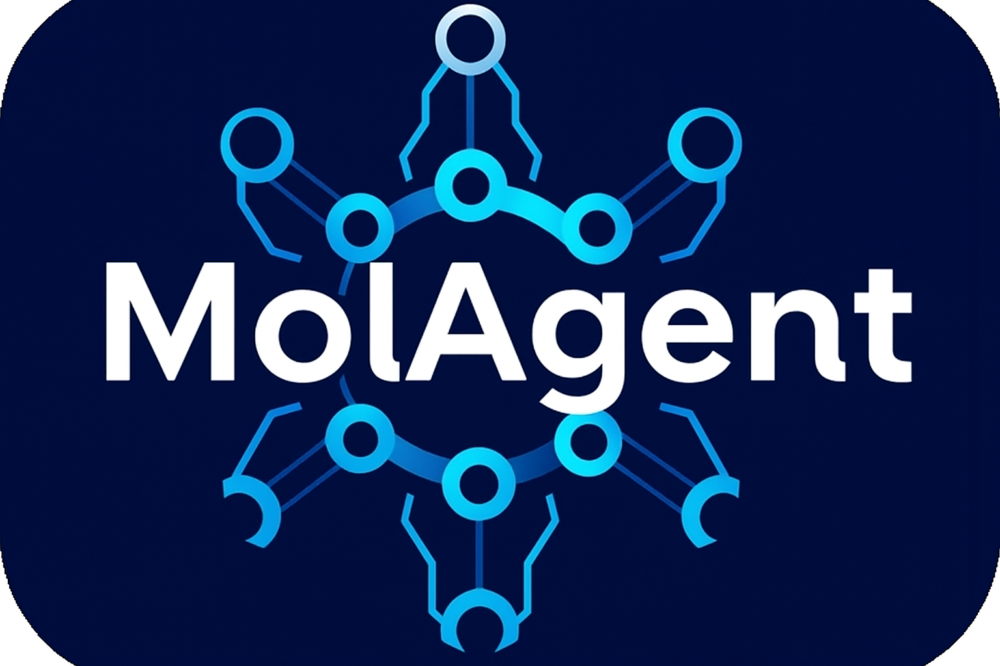
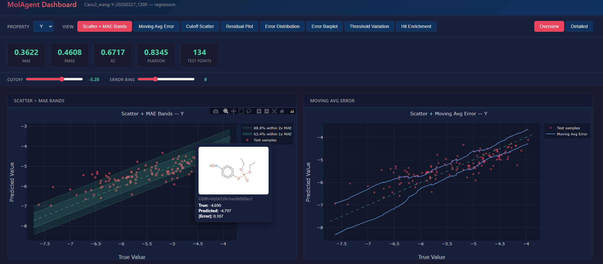
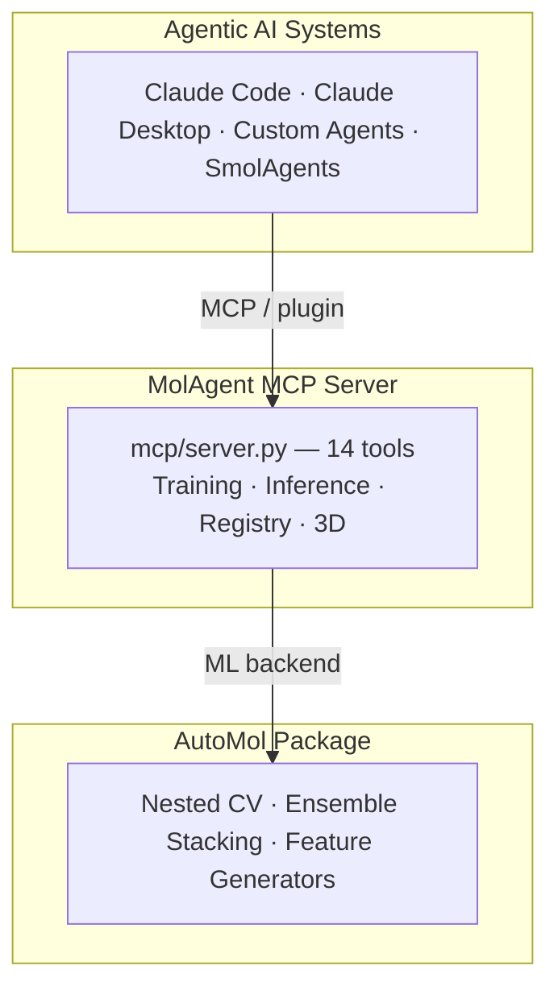

 

# MolAgent

<div align="center">

[](https://github.com/openanalytics/MolAgent)
[](https://python.org)
[](https://docs.anthropic.com/en/docs/agents-and-tools/mcp)
[](https://github.com/openanalytics/AutoMol)
[](LICENSE)
[](https://github.com/openanalytics/MolAgent)

**MolAgent is an evolving Multi-Agent System to support all aspects of early-stage drug discovery**

[Installation](#-quick-start) • [MCP server](#-mcp-server) • [Web app](#-web-app) • [Claude Code](#-claude-code-integration) • [Support](#contacts)

</div>

MolAgent ships as a **14-tool MCP server**, a **SvelteKit web application**, and a **Claude Code plugin**. All three surfaces drive the same [AutoMol](https://github.com/openanalytics/AutoMol) ML backend — nested cross-validation, ensemble stacking, pretrained molecular encoders — without requiring any ML expertise from the user.

> There is also a minimal standalone plugin: [MolAgentLight](https://github.com/JorisTavernier/MolAgentLight).

### Abstract

The advent of agentic AI systems is leading to significant transformations across scientific and technological domains. Computer-aided drug design (CADD)—a multifaceted process encompassing complex, interdependent tasks—stands to benefit profoundly from these advancements. However, a challenge is empowering agentic systems to autonomously construct models for properties estimation that match the quality and reliability of those developed by human experts. As this is not currently straight forward, this capability represents a major bottleneck for fully realizing the potential of autonomous pipelines in drug discovery. We present here MolAgent, a system-agnostic agentic AI framework designed for high-fidelity modeling of molecular properties in early-stage drug discovery. MolAgent autonomously implements expert-level pipelines for both classification and regression, empowering agentic systems to efficiently construct and deploy models. With integrated automated feature engineering, robust model selection, advanced ensemble methodologies, and comprehensive validation frameworks, MolAgent ensures optimal accuracy and model robustness. The platform seamlessly accepts 2D and 3D structural data for ligands and receptors and harmonizes traditional molecular descriptors with advanced deep learning features extracted from pretrained 2D and 3D encoders. Ultimately the platform's fully automated, end-to-end workflow is designed for seamless agentic execution. Adherence to the Model Context Protocol (MCP) guarantees interoperability with diverse agentic AI infrastructures, ensuring flexible integration into complex, future discovery pipelines.

---

### Update September, 2026 — New encoders (breaking default change)

> **Breaking:** `Bottleneck` now refers to the **ChEMBL 37 E-logD (v6_best)** encoder. Previously it pointed to ChEMBL 27. Existing `.pt` model files are unaffected (each pickles its own encoder), but `model_registry.json` entries predating this change that carry `feature_keys: ["Bottleneck"]` now resolve to v6, not ChEMBL 27. Disambiguate by `run_date`.

New encoder keys:

| Key | Encoder | When to use |
|-----|---------|-------------|
| `Bottleneck` | ChEMBL 37 E-logD v6_best | **New default.** Best accuracy for most endpoints. |
| `Bottleneck_chembl37_base` | ChEMBL 37 E-base (no logD supervision) | **logD, logP, lipophilicity** — avoids CV bias from logD leakage. |
| `Bottleneck_chembl27` | Legacy ChEMBL 27 | Reproduce results from models trained before August 2026. |

Other changes in this release:
- Merge now **rejects** models where the same key (`"Bottleneck"`) resolves to different encoder implementations — prevents silent mixing of ChEMBL 27 and v6 weights.
- Feature names are now variant-aware (`Bottleneck_chembl37_base_0`, `Bottleneck_0`) so merged models with multiple encoder variants produce distinct column names.
- MCP timeout defaults (`MCP_TIMEOUT`, `MCP_TOOL_TIMEOUT`, `CLAUDE_CODE_MCP_IDLE_TOOL_TIMEOUT`) are now baked into the SessionStart hook automatically.

---

> **Lipophilicity / logP targets:** use `feature_keys: ["Bottleneck_chembl37_base", "rdkit"]` to avoid label leakage from logD supervision.

## 🚀 Quick Start

### Prerequisites

- Python 3.12, [uv](https://github.com/astral-sh/uv) (`pip install uv`)
- Node.js 18+ (for the web app frontend)

### Install

```bash
git clone --recurse-submodules https://github.com/openanalytics/MolAgent
cd MolAgent
git lfs pull
```

**Linux:**
```bash
chmod +x install.sh && ./install.sh
```

Or manually:
```bash
uv venv .venv --python 3.12
source .venv/bin/activate
uv pip install -r requirements.txt
uv pip install -e "AutoMol/automol[extended]" -e AutoMol/automol_resources
```

> **Windows:** replace the activate line with `.venv\Scripts\activate`. See `install.bat` for a one-shot Windows script.
>
> **WSL with repo on a Windows drive (`/mnt/c/...`):** create the venv on the Linux filesystem to avoid the slow 9p mount (~137× slower per-file):
> ```bash
> uv venv ~/.venvs/molagent --python 3.12
> source ~/.venvs/molagent/bin/activate
> export AUTOMOL_VENV="$HOME/.venvs/molagent"
> ```

---

## 🛠️ MCP Server

All 14 tools are exposed by a single server (`mcp/server.py`). It supports two transports:

- **stdio** — used automatically by Claude Code (via `.mcp.json`)
- **streamable-http** — for remote or multi-user deployments

See also the [mcp-docs](mcp/MCP_SERVER.md).

### Start locally (HTTP)

```bash
source ~/.venvs/molagent/bin/activate
uv run --active --no-sync mcp/server.py
```

The server listens on `http://127.0.0.1:8001/mcp` by default. Training progress is printed to this terminal.

### Start with authentication (remote / multi-user)

```bash
MOLAGENT_AUTH_REQUIRED=true \
MOLAGENT_OUTPUT_ROOT=/abs/path/to/MolagentFiles \
uv run --active --no-sync mcp/server.py --transport streamable-http --host 127.0.0.1 --port 8001
```

The admin token is auto-generated on first run, printed to stderr, and written to `MolagentFiles/admin_token.txt`. Manage users with `mcp/admin_cli.py`:

```bash
# Create a user
python mcp/admin_cli.py --url http://127.0.0.1:8001/mcp --token <ADMIN_TOKEN> create-user alice

# List users
python mcp/admin_cli.py --url http://127.0.0.1:8001/mcp --token <ADMIN_TOKEN> list-users

# Purge stale models/datasets (dry-run)
python mcp/admin_cli.py --url http://127.0.0.1:8001/mcp --token <ADMIN_TOKEN> purge-stale --days 30
```

### Test the server

Inspect via MCP Inspector:
```bash
npx @modelcontextprotocol/inspector
```
Set transport to **Streamable HTTP** and URL to `http://localhost:8001/mcp`.

Or call directly with curl:
```bash
curl -X POST http://127.0.0.1:8001/mcp \
  -H "Content-Type: application/json" \
  -d '{"jsonrpc":"2.0","method":"tools/call","params":{"name":"list_models","arguments":{}},"id":1}'
```

### Available tools

| Tool | Category | Description |
|------|----------|-------------|
| `list_options` | Discovery | Discover available features, estimators, and configs |
| `start_training_session` | Training | Auto-detect dataset, create a config session |
| `answer_training_question` | Training | Accept config overrides interactively |
| `train_and_visualize` | Training | Run the full pipeline — long-running |
| `list_models` | Registry | Query the model registry |
| `predict` | Inference | Run inference on new molecules |
| `merge_models` | Registry | Combine multi-property models |
| `delete_model` | Registry | Remove a model from the registry |
| `download_model` | Registry | Export a model as base64 binary |
| `upload_dataset` | Data | Upload a CSV dataset (base64) |
| `list_datasets` | Data | List the dataset registry |
| `delete_dataset` | Data | Remove a dataset from the registry |
| `admin_manage` | Admin | Token management and registry purge |
| `upload_3d_structure` | 3D | Upload SDF + PDB bundle for structure-based features |

For 3D features, provide an SDF file (containing ligand structures with a `pdb` property pointing to receptor files) and a folder of PDB files. Example: after unzipping `Data/manuscript_data.zip`, use `Data/manuscript_data/ABL/selected_dockings.sdf` with PDBs in `Data/manuscript_data/ABL/pdbs`.

---

## 🌐 Web App

The web app provides a browser UI over the same MCP server.



<sup>Figure: MolAgent interactive dashboard — Caco-2 regression run. Scatter plot with MAE bands and molecular hover tooltip (SmilesDrawer). Metrics panel shows MAE, RMSE, R², Pearson and test set size.</sup>

### Start (one command)

```bash
cd app && ./start.sh
```

- Frontend: http://localhost:5173
- Backend API: http://localhost:8000/api/health

`start.sh` installs frontend dependencies automatically on first run and shuts down both servers cleanly on Ctrl+C.

### Manual start

```bash
# Backend (terminal 1)
cd app
uv run --with fastapi --with uvicorn --with python-multipart --with pydantic-settings --with "fastmcp[tasks]" --with pandas \
  uvicorn backend.main:app --host 127.0.0.1 --port 8000

# Frontend (terminal 2)
cd app/frontend && npm install && npm run dev
```

### Remote MCP mode

To connect the web app to a remote MCP server instead of spawning a local one:

```bash
MCP_SERVER_URL=http://your-server:8001/mcp \
MCP_AUTH_TOKEN=<your_token> \
uv run ... uvicorn backend.main:app --port 8000
```

---

## 🤖 Claude Code Integration

### Plugin mode (recommended)

The project ships a `.mcp.json` that registers the server automatically. Launch Claude Code from the repo root:

```bash
export AUTOMOL_VENV="$HOME/.venvs/molagent"
claude --plugin-dir .
```

This registers the MCP server and provides three skills (`train-pipeline`, `predict`, `visualize`). You can then use natural language:

```
> Train a model on my_molecules.csv with target property potency
> Predict properties for new_molecules.csv using my trained model
> Visualize the results from my last training run
```

Or invoke skills directly with `/train-pipeline`, `/predict`, `/visualize`.

### MCP only (Claude Desktop or any MCP client)

Start the HTTP server as shown above, then register it in Claude Desktop. Without auth:

```bash
claude mcp add --transport http molagent http://127.0.0.1:8001/mcp
```

With auth enabled (`MOLAGENT_AUTH_REQUIRED=true`):

```bash
claude mcp add --transport http molagent http://127.0.0.1:8001/mcp \
  --header "Authorization: Bearer <USER_TOKEN>"
```

Or register any MCP client against `http://127.0.0.1:8001/mcp` (streamable-http transport), passing `Authorization: Bearer <USER_TOKEN>` as a request header.

---

## 🐍 FastMCP Client (Python)

You can drive the server directly from Python using the FastMCP client.

```python
import asyncio
from fastmcp import Client

client = Client("http://127.0.0.1:8001/mcp", timeout=1e10)

async def main():
    async with client:
        import base64, pathlib
        csv_bytes = pathlib.Path("Data/manuscript_data/ChEMBL_SMILES.csv").read_bytes()

        # Upload dataset
        upload = await client.call_tool("upload_dataset", arguments={
            "filename": "ChEMBL_SMILES.csv",
            "content_base64": base64.b64encode(csv_bytes).decode(),
        })
        dataset_id = upload[0].text

        # Start training session
        session = await client.call_tool("start_training_session", arguments={
            "dataset_id": dataset_id,
            "smiles_column": "smiles",
            "target_column": "prop1",
            "feature_keys": ["Bottleneck", "rdkit"],
            "computational_load": "cheap",
        })

        # Run full pipeline
        result = await client.call_tool("train_and_visualize", arguments={
            "session_id": session[0].text,
        })
        print(result)

asyncio.run(main())
```


---

## 🤗 SmolAgents / Gradio Integration

The notebook [Lipophilicity_AstraZeneca.ipynb](MCP/Lipophilicity_AstraZeneca.ipynb) shows integration using SmolAgents and a Gradio interface. [MolAgent_multiagent.ipynb](MCP/MolAgent_multiagent.ipynb) contains multi-agent examples including the ABL1 case from the paper.

### Gradio chatbot

After starting the MCP server, launch the SmolAgents-powered chatbot:

```bash
source ~/.venvs/molagent/bin/activate
uv run --active --no-sync demos/gradio_mcp_agent.py
```

App is available at http://127.0.0.1:7860. Install extra dependencies first:

```bash
uv pip install 'smolagents[mcp,litellm]' litellm boto3
```

Configure via `.env`:
```bash
ANTHROPIC_API_KEY=xxxx
HF_TOKEN=xxxx
MODEL_ID=openrouter/anthropic/claude-sonnet-4
```

The demo supports **AWS Bedrock** (via LiteLLM) and the HuggingFace Inference API. Use the Gradio file picker to attach a `.csv` — it is automatically uploaded to the dataset registry and injected as a `dataset_id` before the agent runs.

---

## 📊 Benchmark Performance

MolAgent achieves competitive performance with expert-crafted models on TDC benchmarks using only "cheap" computational budget:

| Dataset | MolAgent | Best by human | Ranking | Metric |
|---------|----------|---------------|---------|--------|
| Caco2_Wang | 0.303±0.002 | 0.276±0.005 | 6th | MAE |
| Hia_hou | 0.87±0.006 | 0.989±0.001 | 14th | AUROC |
| pgp_broccatelli | 0.849±0.005 | 0.938±0.006 | 15th | AUROC |
| Bioavailability_ma | 0.619±0.028 | 0.748±0.033 | 10th | AUROC |
| Lipophilicity_astrazeneca | 0.309±0.001 | 0.467±0.006 | 🥇 1st | MAE |
| Solubility_aqsoldb | 0.889±0.001 | 0.761±0.024 | 8th | MAE |
| bbb_martins | 0.757±0.004 | 0.916±0.001 | 21st | AUROC |
| Ppbr_az | 7.86±0.3 | 7.526±0.106 | 4th | MAE |
| Vdss_lombardo | 0.29±0.175 | 0.713±0.007 | 13th | Spearman |
| Cyp2d6_veith | 0.386±0.007 | 0.790±0.001 | 14th | AUPRC |
| Cyp3a4_veith | 0.704±0.001 | 0.916±0.000 | 14th | AUPRC |
| Cyp2c9_veith | 0.605±0.004 | 0.859±0.001 | 15th | AUPRC |
| Cyp2d6_substrate_carbonmangels | 0.526±0.027 | 0.736±0.025 | 13th | AUPRC |
| Cyp3a4_substrate_carbonmangels | 0.613±0.019 | 0.662±0.031 | 10th | AUROC |
| Cyp2c9_substrate_carbonmangels | 0.384±0.017 | 0.441±0.033 | 8th | AUPRC |
| Half_life_obach | 0.332±0.047 | 0.562±0.008 | 7th | Spearman |
| Clearance_microsome_az | 0.651±0.04 | 0.630±0.010 | 🥇 1st | Spearman |
| Clearance_hepatocyte_az | 0.445±0.028 | 0.498±0.009 | 🥉 3rd | Spearman |
| herg | 0.624±0.02 | 0.880±0.002 | 17th | AUROC |
| ames | 0.793±0.005 | 0.871±0.002 | 13th | AUROC |
| dili | 0.778±0.025 | 0.925±0.005 | 16th | AUROC |
| Ld50_zhu | 0.606±0.0 | 0.552±0.009 | 🥉 3rd | MAE |

<sup>Results with "cheap" computational budget across ADMET tasks from the TDC benchmark. Mean ± std over 5 independent runs. MAE: lower is better. AUROC/AUPRC/Spearman: higher is better.</sup>

---

## Key Environment Variables

| Variable | Purpose | Default |
|----------|---------|---------|
| `AUTOMOL_VENV` | Virtual environment path | `.venv` |
| `MOLAGENT_OUTPUT_ROOT` | Pipeline output directory | `./MolagentFiles` |
| `MOLAGENT_AUTH_REQUIRED` | Enable token auth on MCP server | off |
| `MOLAGENT_DETERMINISTIC` | Seed RNGs, force serial CV | off |
| `MCP_TIMEOUT` | Max time (ms) for MCP server to start | `1800000` |
| `MCP_TOOL_TIMEOUT` | Max time (ms) a single tool call can run | `172800000` |
| `CLAUDE_CODE_MCP_IDLE_TOOL_TIMEOUT` | Max idle time (ms) for a tool call | `172800000` |

The SessionStart hook writes timeout defaults into `.claude/settings.local.json` automatically. `MCP_TIMEOUT=1800000` (30 min) covers slow first-time `uv` dependency resolution; the 48 hr tool timeouts cover `expensive` computational load training.

---

## Architecture

MolAgent bridges expert-level molecular modeling and agentic AI via the [AutoMol](https://github.com/openanalytics/AutoMol) ML backend:


```mermaid
graph TB
    subgraph "Agentic AI Systems"
        AG["`Claude Code · Claude Desktop · Custom Agents · SmolAgents`"]
    end
    subgraph "MolAgent MCP Server"
        MS["`mcp/server.py — 14 tools
Training · Inference · Registry · 3D`"]
    end
    subgraph "AutoMol Package"
        AP["`Nested CV · Ensemble Stacking · Feature Generators`"]
    end
    AG -->|MCP / plugin| MS
    MS -->|ML backend| AP
```

---

## 📄 Citation

**MolAgent: Biomolecular Property Estimation in the Agentic Era**

Jose Carlos Gómez-Tamayo\*, Joris Tavernier\*\*, Roy Aerts\*\*\*, Natalia Dyubankova\*, Dries Van Rompaey\*, Sairam Menon\*, Marvin Steijaert\*\*, Jörg Wegner\*, Hugo Ceulemans\*, Gary Tresadern\*, Hans De Winter\*\*\*, Mazen Ahmad\*

> \*Johnson & Johnson · \*\*Open Analytics NV · \*\*\*University of Antwerp

**Funding**: Partly funded by VLAIO project HBC.2021.112.

```bibtex
@article{molagent2025,
  author  = {Gómez-Tamayo, Jose Carlos and Tavernier, Joris and Aerts, Roy and Dyubankova, Natalia and Van Rompaey, Dries and Menon, Sairam and Steijaert, Marvin and Wegner, J{\"o}rg Kurt and Ceulemans, Hugo and Tresadern, Gary and De Winter, Hans and Ahmad, Mazen},
  title   = {MolAgent: Biomolecular Property Estimation in the Agentic Era},
  journal = {Journal of Chemical Information and Modeling},
  volume  = {65},
  number  = {20},
  pages   = {10808--10818},
  year    = {2025},
  doi     = {10.1021/acs.jcim.5c01938},
}
```

---

## References

1. [scikit-learn](https://scikit-learn.org/stable/)
2. [Therapeutic Data Commons](https://tdcommons.ai/)
3. [molfeat](https://molfeat.datamol.io/)
4. [PyTorch](https://pytorch.org/)
5. [FastMCP](https://github.com/jlowin/fastmcp)
6. [ProLIF](https://prolif.readthedocs.io/): Bouysset & Fiorucci. J Cheminform 13, 72 (2021).
7. [SmilesDrawer](https://github.com/reymond-group/smilesDrawer): Probst & Reymond. JCIM 58(1), 1–7 (2018).

---

## License

[](LICENSE) See [LICENSE](LICENSE) for details.

## Contacts

- **Developers**: Joris Tavernier, Marvin Steijaert, Jose Carlos Gómez-Tamayo, Mazen Ahmad
- **Maintainers**: joris.tavernier@openanalytics.eu, Marvin.Steijaert@openanalytics.eu
